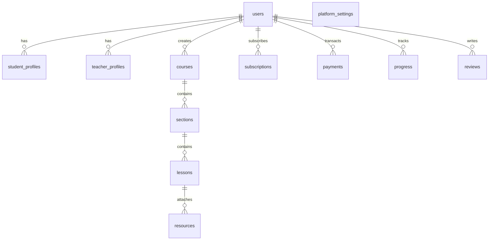

# Korsa — Direct Teacher-to-Subscriber Educational Platform

> **A modern, transparent, direct educator subscription platform built on a 100% $0-Cost local stack.**  
> Inspired structurally by direct subscription economics, but tailored specifically for legitimate academic instruction, exam preparation, and subject mastery.

---

## 🌟 Overview & Core Philosophy

Korsa is a full-stack educational creator platform where teachers publish courses, offer free sample lessons, and earn recurring monthly subscription income directly from enrolled students.

### The $0-First Guarantee
- **$0 Database Costs**: Powered entirely by Node.js built-in `node:sqlite` (`DatabaseSync`) in Write-Ahead Logging (WAL) mode. No cloud databases, monthly hosting fees, or credit cards required.
- **$0 Payment Processing Fees**: Uses a built-in simulated billing engine that mirrors Stripe webhook lifecycles, ledger deductions, invoice generation, and teacher payout calculations without live payment gateway fees.
- **$0 Third-Party Subscriptions**: Fully self-contained local development environment running on React 19, Vite 8, Express 5, and Node.js v24.

---

## 🏛️ System Architecture

```
learnly-app/
├── server/                    # Node.js + Express 5 Backend API
│   ├── index.js              # Server entry point (port 3001)
│   ├── db.js                 # Native SQLite single-file database engine (node:sqlite)
│   ├── seed.js               # Seed script with realistic demo data
│   ├── auth.js               # JWT authentication middleware & password hashing
│   └── routes/
│       ├── auth.js           # Student & teacher registration and login
│       ├── teachers.js       # Teacher public profiles, catalog discovery, & search
│       ├── courses.js        # Course curriculum retrieval with access control
│       ├── subscriptions.js  # Simulated subscription creation, cancellation, & billing
│       ├── progress.js       # Lesson completion & video progress tracking
│       ├── reviews.js        # Verified subscriber ratings, reviews, & moderation
│       ├── teacherDashboard.js # Teacher Studio: courses, sections, lessons, & revenue
│       └── admin.js          # Platform commission settings, users, & DB backups
├── src/                      # React 19 + Vite 8 Single-Page Application
│   ├── components/           # Navbar, Footer, VideoModal, SubscribeModal, AuthModal
│   ├── context/              # AuthContext (state, JWT persistence, quick role switch)
│   ├── pages/
│       ├── LandingPage.jsx       # Discovery catalog, live search, and subject filters
│       ├── TeacherProfilePage.jsx# Public teacher page, course curriculum, and reviews
│       ├── StudentDashboard.jsx  # Student learning tracker, subscriptions, & invoices
│       ├── TeacherDashboard.jsx  # Teacher Studio curriculum builder & revenue analytics
│       └── AdminDashboard.jsx    # Admin governance, reviews moderation, & DB backup
│   ├── index.css             # Vanilla CSS design tokens & responsive media queries
│   └── App.jsx               # Client-side router & global modal manager
└── learnly.db                # Live relational SQLite database file
```

---

## 🚀 Quick Start & Local Setup

### Prerequisites
- **Node.js**: `v20.x` or `v24.x` recommended (uses built-in `node:sqlite`).
- **npm**: `v10.x` or higher.

### 1. Installation
Clone the repository and install all dependencies:
```bash
npm install
```

### 2. Start Development Server
Run the backend API and frontend client concurrently:
```bash
npm run dev
```
- **Frontend App**: [http://localhost:5173](http://localhost:5173)
- **Backend API**: [http://localhost:3001](http://localhost:3001)
- *The Vite development server automatically proxies `/api` requests to port `3001`.*

### 3. Production Build Check
To verify bundle compilation and TypeScript/JSX types with zero errors:
```bash
npm run build
```

---

## 🔑 Default Seeded Test Accounts

Korsa seeds ready-to-test accounts representing each platform role. All accounts share the same password for fast local testing:

> **Universal Password**: `learnly123`

| Role | Name | Email | Password | Primary Capabilities |
| :--- | :--- | :--- | :--- | :--- |
| **Student** | Adam Miller | `student@learnly.com` | `learnly123` | Discover teachers, watch free sample lessons, subscribe, rate teachers, track progress |
| **Teacher** | Dr. Jordan Reed | `jordan.math@learnly.com` | `learnly123` | AP Calculus, Linear Algebra, Content Studio, curriculum builder, revenue analytics |
| **Teacher** | Sarah Jenkins | `sarah.lit@learnly.com` | `learnly123` | AP English Literature & Essay Writing courses |
| **Teacher** | Elena Rostova | `elena.physics@learnly.com` | `learnly123` | Classical Mechanics & Electromagnetism courses |
| **Admin** | Administrator | `admin@learnly.com` | `learnly123` | Platform governance, commission take-rate slider, reviews moderation, DB export |

> 💡 **Quick Switcher**: Click the **`⚡ Role: ...`** dropdown pill in the top navigation bar at any time to instantly jump between Student, Teacher, and Admin personas with a single click.

---

## 🎯 Key Feature Highlights

### 1. Tiered Access Control (Free vs. Subscriber-Only)
- **Free Sample Lessons**: Anyone can watch introductory lessons, preview teaching style, and evaluate curriculum value before committing.
- **Subscriber-Only Lessons**: High-value deep dives, solution videos, and exam preparation material are protected behind active subscriptions.
- **Video Embed Support**: Supports standard video embeds (YouTube, Vimeo, Cloudflare Stream, or direct video URLs).

### 2. Teacher Content Studio & Curriculum Builder
- **Course Management**: Create, edit, and organize multiple courses by subject and academic grade level.
- **Section & Lesson Builder**: Organize modules into chapters/sections, add lessons with custom descriptions, video URLs, and durations.
- **Interactive Reordering**: Shift lesson orders up or down in real-time.
- **Access Level Toggles**: One-click switch between `FREE` and `SUBSCRIBER_ONLY` access.

### 3. Transparent Creator Economics & Revenue Analytics
- **Configurable Commission**: Platform administrators can dynamically adjust the take rate (default: `20%`).
- **Teacher Earnings**: Teachers retain `80%` (or platform complement) of all gross student subscriptions.
- **Real-Time Financial Dashboard**: Visual metrics for gross subscription volume, platform cut, net payouts, and itemized billing ledger.

### 4. Verified Student Reviews & Admin Moderation
- **Authenticity Protection**: Only active, subscribed students can submit star ratings (1–5) and written feedback for a teacher.
- **Duplicate Prevention**: Prevents spam by seamlessly updating a student's existing review upon resubmission.
- **Admin Moderation Hub**: Administrators can inspect reviews across all teachers, temporarily hide inappropriate comments, or permanently delete spam.

### 5. 1-Click Database Backup & Export (Admin Hub)
- **JSON Snapshot Export**: Generates and downloads a complete, human-readable JSON snapshot containing all 13 relational tables with preserved timestamps and relational keys.
- **Raw SQLite Binary Download**: Instantly downloads the binary database backup file (`korsa-backup.db`) for offline inspection with `sqlite3` CLI, SQLite Studio, or DBeaver.

---

## 🗄️ Relational Database Schema (13 Tables)



1. **`users`**: Account credentials, hashed passwords, roles (`student`, `teacher`, `admin`), and avatars.
2. **`student_profiles`**: Educational grade levels, bios, and student preferences.
3. **`teacher_profiles`**: Headline, subject specializations, biography, and monthly subscription price.
4. **`subjects`**: Standardized academic fields (Mathematics, Physics, Chemistry, Literature, etc.).
5. **`courses`**: Course metadata, educational levels, and publication status.
6. **`sections`**: Logical units organizing a course curriculum.
7. **`lessons`**: Titles, video URLs, duration in minutes, descriptions, and `FREE` / `SUBSCRIBER_ONLY` access levels.
8. **`resources`**: Downloadable course materials, PDF notes, and assignment links.
9. **`subscriptions`**: Active, cancelled, and expired subscription states with monthly renewal timestamps.
10. **`payments`**: Itemized transaction ledger tracking gross amounts, platform commission, and teacher payouts.
11. **`progress`**: Student video watch status and completion checkpoints.
12. **`reviews`**: 1–5 star ratings, feedback commentary, and administrative moderation flags.
13. **`platform_settings`**: Dynamic key-value platform configurations (e.g., `platform_commission_percentage`).

---

## 📱 Mobile & Tablet Responsiveness

Korsa has been engineered with a responsive design system:
- **Collapsible Navigation**: Responsive hamburger menu on mobile viewports with quick role switching.
- **Touch-Friendly Tables**: Every data ledger, transaction list, and moderation queue is wrapped in `.table-responsive` with smooth horizontal touch-swiping.
- **Curriculum Accordions**: Flexible wrapping prevents button clipping on narrow phone screens (375px+).
- **Responsive Modals**: Viewport-aware modals with touch scroll containment.

---

## 🧪 Testing & Verification Guide

### Automated Verification
Run the complete production build test:
```bash
npm run build
```
Verify zero errors or unhandled modules.

### Manual Verification Checklist
1. **Student Journey**:
   - Log in as `student@learnly.com`.
   - Browse the catalog, filter by Mathematics, click Dr. Jordan Reed's profile.
   - Click "Watch Free Sample" on Lesson 1 — video player opens smoothly.
   - Click a locked lesson — subscription modal opens.
   - Subscribe via simulated checkout — instant access granted, receipt appears in student ledger.
   - Leave a 5-star review with verified subscriber badge.
2. **Teacher Journey**:
   - Switch to `jordan.math@learnly.com`.
   - Open Teacher Studio, edit a course, add a new section, add a lesson.
   - Reorder lessons using the Up/Down controls.
   - Open Revenue Analytics to inspect gross volume and net earnings calculations.
3. **Admin Journey**:
   - Switch to `admin@learnly.com`.
   - In Admin Hub, adjust the platform take rate from 20% to 25% and save.
   - Inspect reviews moderation queue and toggle review visibility.
   - Go to **Database Backup & Export** and download both the **JSON Data Snapshot** and **Raw SQLite (.db)**.

---

## 📄 License
MIT License. Built for open educational access and creator-direct learning.
